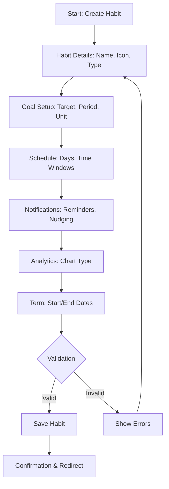

# Habyss Custom Habit Creation Screen - Product Specification

## 1. Product Overview
The Custom Habit creation screen is the core interface for users to define and configure personal habits they want to build or quit. This screen transforms user intentions into structured, trackable habits with intelligent defaults and flexible customization options.

Target audience: Gen-Z productivity enthusiasts who want a modern, intuitive habit tracking experience with data-driven insights.

## 2. Core Features

### 2.1 Feature Module
The Custom Habit creation screen consists of the following main sections:
1. **Habit Details**: Icon, name, description, color, group assignment, and habit type selection
2. **Goal Setup**: Target configuration including period, value, and measurement units
3. **Schedule**: Task days patterns and time range windows
4. **Notifications**: Reminder system with smart nudging capabilities
5. **Analytics**: Chart type selection and progress visualization preferences
6. **Term**: Start/end dates and habit lifecycle management

### 2.2 Page Details

| Section | Module Name | Feature Description |
|---------|-------------|-------------------|
| Habit Details | Icon Selector | Tap to change habit icon with auto-suggestions based on habit name, supporting emoji, SF Symbols, and custom images |
| Habit Details | Name Field | Required text field (max 60 chars) with real-time validation and duplicate detection |
| Habit Details | Description | Optional multi-line field (max 300 chars) supporting markdown-lite formatting |
| Habit Details | Color Picker | Opens color selector with preset palette and custom HSB picker with contrast validation |
| Habit Details | Group Assignment | Optional folder organization with create new group capability |
| Habit Details | Habit Type | Segmented control for Build vs Quit habits with different success logic |
| Goal Setup | Goal Period | Selector for daily, weekly, monthly, per-session, or custom range tracking periods |
| Goal Setup | Goal Value | Numeric target input with validation based on habit type (Build: ≥ goal, Quit: ≤ goal) |
| Goal Setup | Unit Selector | Measurement units: count, minutes, hours, pages, kg, km, steps, or custom text |
| Schedule | Task Days | Flexible scheduling patterns: every day, weekdays, weekends, custom days, intervals, or weekly count |
| Schedule | Time Range | Segmented control mapping to specific hour windows with custom time range support |
| Notifications | Reminders Toggle | Enable/disable notification system with multiple reminder times per habit |
| Notifications | Smart Nudging | Optional intelligent reminders based on completion status and time windows |
| Analytics | Chart Type | Bar or line chart selection for progress visualization |
| Term | Start/End Dates | Date pickers for habit lifecycle with archive functionality |
| Interaction | HabitBar Gestures | Configurable tap, long press, swipe actions for quick habit management |
| Interaction | Memo System | Optional reflection prompts after habit completion with mood tracking |

## 3. Core Process

### User Flow for Creating a Custom Habit
1. **Entry**: User taps "Create Habit" from main screen
2. **Basic Setup**: Configure habit name, icon, and type (Build/Quit)
3. **Goal Configuration**: Set target value, period, and measurement unit
4. **Schedule Setup**: Define when habit should be tracked (days and time windows)
5. **Notification Preferences**: Configure reminders and smart nudging
6. **Analytics Setup**: Choose chart type for progress visualization
7. **Lifecycle Management**: Set start date and optional end date
8. **Save**: Validate and create habit with confirmation



## 4. User Interface Design

### 4.1 Design Style
- **Primary Colors**: Deep purple (#6B46C1) for Build habits, crimson (#DC2626) for Quit habits
- **Secondary Colors**: Dark theme with charcoal background (#1A1A1A), card surfaces (#2D2D2D)
- **Button Style**: Rounded rectangles with subtle shadows, primary actions use gradient fills
- **Typography**: SF Pro Display for headers, SF Pro Text for body, Dynamic Type support
- **Layout**: Card-based with generous whitespace, iOS-style navigation bars
- **Icons**: SF Symbols for consistency, emoji support for personalization

### 4.2 Page Design Overview

| Section | Module | UI Elements |
|---------|--------|-------------|
| Top Bar | Navigation | Back chevron (16pt), title "Custom Habit" (34pt → 32pt), star icon (18pt) |
| Habit Card | Icon Selector | 56x56pt rounded square, tappable with haptic feedback, auto-suggest overlay |
| Habit Card | Name Field | 17pt font, 48pt height, inline validation with red underline |
| Habit Card | Description | 15pt font, expands to 4 lines, placeholder text in secondary color |
| Color Row | Color Picker | Circular swatch (24pt), chevron indicator, contrast badge if fails |
| Goal Section | Period Selector | 15pt label, value in primary color, disclosure indicator |
| Goal Section | Value Input | Number pad keyboard, increment/decrement buttons, unit suffix |
| Schedule | Task Days | Chip-style selection, "Every Day" as default highlighted |
| Schedule | Time Range | Segmented control with 4 options, custom window picker modal |
| Reminders | Toggle Row | iOS-style switch, count badge when multiple reminders set |
| Analytics | Chart Selector | Visual preview of each chart type in segmented control |
| Bottom | Save Button | Full-width primary button, disabled state with reduced opacity |

### 4.3 Responsiveness
- **Desktop-first**: Optimized for iPhone screens with iPad adaptation
- **Dynamic Type**: Supports all iOS text size settings
- **Touch targets**: Minimum 44pt for all interactive elements
- **Landscape support**: Maintains usability with adjusted layouts

### 4.4 Accessibility
- VoiceOver labels for all interactive elements
- High contrast mode support with automatic color adjustments
- Reduced motion support for animations
- Large text handling with automatic layout adjustments

## 5. Technical Specifications

### 5.1 Data Model

**Habit Entity Structure:**
```typescript
interface Habit {
  id: string;
  userId: string;
  name: string;
  description?: string;
  icon?: string;
  color: string;
  groupId?: string;
  type: 'build' | 'quit';
  goalPeriod: GoalPeriod;
  goalValue: number;
  unit: UnitPreset;
  taskDays: TaskDaysPattern;
  timeRange: TimeRangePreset;
  reminders: Reminder[];
  chartType: 'bar' | 'line';
  startDate: string;
  endDate?: string;
  timezone: string;
  isArchived: boolean;
  showMemoAfterCompletion: boolean;
  habitBarGesture: GestureConfig;
  createdAt: string;
  updatedAt: string;
}
```

**Habit Entry Structure:**
```typescript
interface HabitEntry {
  id: string;
  habitId: string;
  date: string;
  value: number;
  memo?: {
    text?: string;
    moodTag?: string;
    photoIds?: string[];
    rating?: number;
    createdAt: string;
  };
  skipped: boolean;
  autoLogged?: boolean;
  createdAt: string;
  updatedAt: string;
}
```

### 5.2 Validation Rules

**Required Fields:**
- Habit name (non-empty, max 60 characters)
- Goal value (≥ 0, ≤ 9999)
- Start date (cannot be in future by more than 1 day)
- Color (must meet WCAG AA contrast)

**Business Logic:**
- Quit habits: success when value ≤ goal
- Build habits: success when value ≥ goal
- End date must be ≥ start date
- Custom time windows cannot overlap
- Reminder times must respect quiet hours

### 5.3 Smart Defaults

**Auto-suggestions based on habit name:**
- "Read" → unit: pages, icon: 📚, color: blue
- "Run" → unit: minutes, icon: 🏃, color: green
- "Water" → unit: count, icon: 💧, color: cyan
- "Meditate" → unit: minutes, icon: 🧘, color: purple
- "No Sugar" → type: quit, goal: 0, color: red

**Time Range Defaults:**
- Morning: 6:00-12:00
- Afternoon: 12:00-18:00
- Evening: 18:00-22:00
- Anytime: 00:00-23:59

## 6. Edge Cases and Error Handling

### 6.1 Validation Errors
- **Missing name**: "Give your habit a name to track progress"
- **Invalid date range**: "End date must come after start date"
- **Goal value zero**: Warning for Build habits: "Zero goal means any progress counts"
- **Duplicate names**: Warning with option to proceed: "You already have '[name]' - create anyway?"
- **Color contrast failure**: "This color may be hard to read - try a lighter/darker shade"

### 6.2 Permission Handling
- **Notifications disabled**: Inline banner with "Open Settings" deep link
- **Photos access**: Request only when user tries to add photo to memo
- **HealthKit integration**: Optional permission for auto-logging fitness habits

### 6.3 State Management
- **Offline mode**: Queue changes locally, sync when connection restored
- **Background refresh**: Update streaks and reminders while app inactive
- **Timezone changes**: Recalculate all reminder schedules automatically
- **Daylight saving**: Handle time shifts gracefully with 1-hour buffer

## 7. Success Metrics

### 7.1 User Engagement
- Habit creation completion rate (target: >85%)
- Average time to create habit (target: <2 minutes)
- Advanced feature usage rate (custom ranges, gestures)
- Reminder enablement rate (target: >60%)

### 7.2 Technical Performance
- Screen load time (target: <500ms)
- Form validation response (<100ms)
- Color picker interaction (<200ms)
- Save operation (<1s)

### 7.3 Quality Metrics
- Crash rate (target: <0.1%)
- Validation error rate (target: <5%)
- User-reported bugs (target: <2 per 1000 creations)
- Accessibility compliance (target: 100% WCAG 2.1 AA)

## 8. Future Considerations

### 8.1 Advanced Features (Post-MVP)
- AI-powered habit suggestions based on user behavior
- Social sharing and accountability features
- Integration with wearable devices
- Advanced analytics with trend predictions
- Habit templates and community sharing

### 8.2 Platform Extensions
- Apple Watch companion app
- iPad optimized layout
- macOS native app
- Siri shortcuts for quick logging
- Shortcuts app integration

### 8.3 Internationalization
- Right-to-left language support
- Locale-specific week start preferences
- Cultural habit suggestions
- Local holiday and work schedule awareness